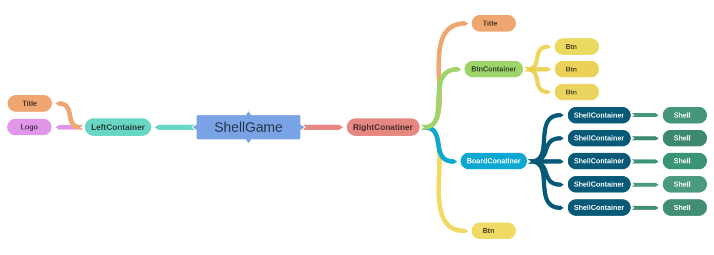

# ShellGame
**this is a Simple shell game, the objective of the game is:**
* given a ball attached to one of the shells follow that shell and pick the right one.
* the shells will be randomly sheffield when you click play if you picked the right one you will get 20 points to your score.
* there are three levels to pick normal, hard and extreme.
* in normal mode you have three shells and one ball
* in hard mode you have 4 shells and 1 ball
* in extreme mode you have 5 shells and 2 balls
* in extreme mode if you pick only one right you will get only 10 points

## Game layout

## Component Structure

